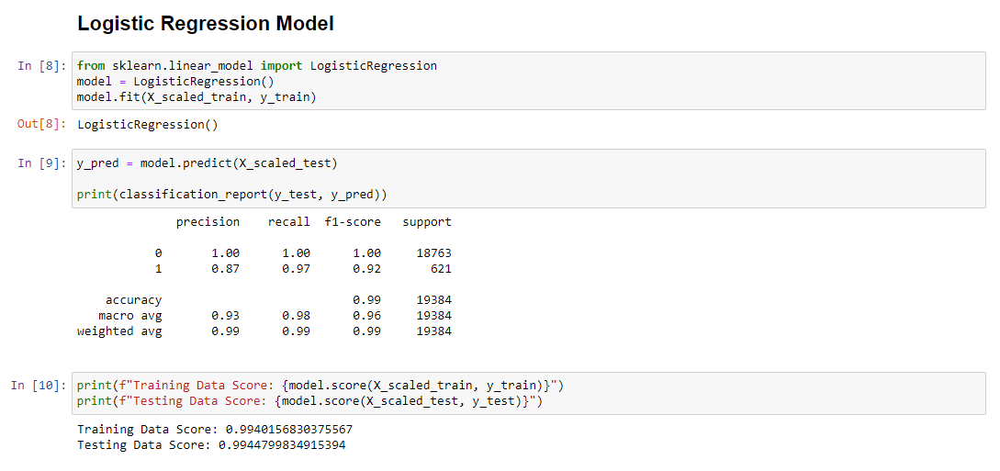
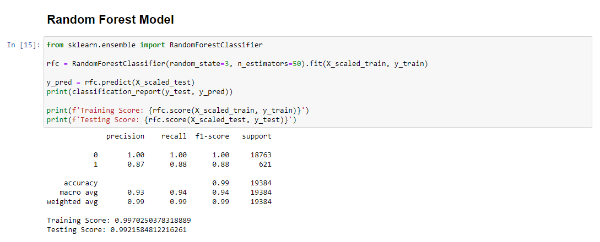

# Supervised Machine Learning - Predicting Credit Risk

This machine learning model attempts to predict whether a loan will be approved or not. 

## Background

Lending services companies allow individual investors to partially fund personal loans as well as buy and sell notes backing the loans on a secondary market. This data will be used to determine whether a borrower is creditworthy and should be issued a loan. 

This data set is used specifically for comparing the Logistic Regression model and Random Forest Classifier.

## Tools
* Python 3.8
* sklearn 
* Matplotlib
* Pandas

## Instructions

### Retrieve the data

The data is located in the Resources folder.

* `lending_data.csv`

## Images

